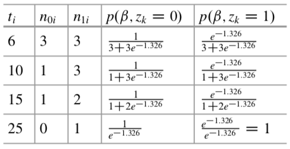
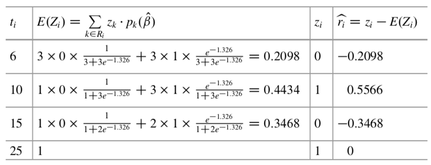

```{r setup, include=FALSE}
knitr::opts_chunk$set(echo = TRUE)
library(tidyverse)
library(survival)
library(survminer)
library(broom)
library(asaur)
```

### Assessing goodness of fit using residuals    
The use of residuals for model checking has been well-developed in linear regression theory. The residuals are plotted versus some quantity, such as a covariate value, and the observed pattern is used to diagnose possible problems with the fitted model. Some residuals have the additional property of not only indicating problems but also suggesting remedies. That is the pattern of the plotted residuals may suggest an alternative model that fits the data better.    
<br />

Many of these residuals have been generalized to survival analysis. In addition, the fact that survival data evolves over time, and requires special assumptions such as proportional hazards, makes it necessary to develop additional diagnostic residual methods.    
<br />

#### Martingale and deviance residuals    
An important tool for assessing the goodness of fit of a model is to compare the censoring indicator (0 for censored, 1 for death) for each subject to the expected value of that indicator under the proportional hazards Cox model.    
If there are no time dependent covariates and if the survival times are right-censored, this is given by    

$$
m_i = \delta_i - \hat{H_0}(t_i) \exp(z'_i \hat{\beta})
$$

These residuals, which originate from the counting process theory underlying the Cox proportional hazards model, sum to 0, range in value from $-\infty$ to a maximum of 1, and each has an expected value of zero.    
The residual is essentially the difference between the observed value (1 or 0) of the censoring indicator and its expected value under a particular Cox model.    
The asymmetry of the residuals might appear to be a disadvantage, but Therneau and Grambsch, in Chap. 5, show that a plot of these residuals versus the covariate $z$ can reveal not only discrepancies in the model but also the actual functional form of this covariate.    
**Martingale residuals** may be used much as residuals that the reader may be familiar with from linear regression.    
<br />

However, unlike those, the sum of squares of Martingale residuals cannot be used as a measure of goodness of fit. The **“deviance” residual** is an alternative that does have this property.    
It may defined in terms of the martingale residual as follows:     

$$
d_i = sign (m_i) \cdot \{ -2 \cdot [m_i + \delta_i \log(\delta_i - m_i)]  \}^{1/2}
$$

These residuals are symmetrically distributed with expected value 0 (if the fitted model is correct).    
**The sum of squares of these residuals is the value of the likelihood ratio test, which is analogous to the deviance from generalized linear model theory.**    
While the properties of deviance residuals might seem preferable to those of martingale residuals, only the latter have the property of showing us the functional form of a covariate. For this reason, in practice, the martingale residuals are more useful.      

*Example 1:*   
Consider the `pharmacoSmoking` dataset, and a fit of the “null” Cox proportional hazards model.    
A null model is one with no fitted covariates. There is still a partial likelihood, and the model produces martingale residuals which take the form $m_i = \delta_i - \hat{H_0}(t_i) \exp(z' \beta)$.    
We may plot these against continuous predictors to get a preliminary assessment of which of these predictors should be in the model, and what form they should take.   
<br />

We first read in the data and truncate the variable “priorAttempts” at 20, since recorded values of this variable that exceed 20 are not likely to be correct,     

```{r}
prior_attempts_T <- pharmacoSmoking %>% 
  tbl_df() %>% 
  mutate(priorAttemptsT = ifelse(priorAttempts > 20, 20, priorAttempts))
```

We may fit the null model and obtain these residuals as follows:     

```{r}
result_null_coxph <- coxph(Surv(ttr, relapse) ~ 1, prior_attempts_T)
resid_null_coxph <- residuals(result_null_coxph, type = "martingale")
```

We next assess the potential relationship of survival to age, prior attempts at quitting, and longest prior period without smoking.     
We plot these null model residuals versus each of these variables and also versus log transformations of these variables.    
In the following, since the smallest value of “prior_attempts_T” and “longestNoSmoke” is zero, we add one to each before taking the log transformation.    
We fit a “loess” smooth curve through each set of residuals to better assess the shapes of the relationships, using the `loess` function.     
In order to also get 95 % confidence intervals for these smooth curves, we use the function `smoothSEcurve`, a simple plotting function that is defined in the appendix.   

```{r}
smoothSEcurve <- function(yy, xx) {
  # use after a call to "plot"
  # fit a lowess curve and 95% confidence interval curve
  
  # make list of x values
  xx.list <- min(xx) + ((0 : 100) / 100) * (max(xx) - min(xx))
  
  # Then fit loess function through the points (xx, yy) # at the listed values
  yy.xx <- predict(loess(yy ~ xx), se = T, newdata = data.frame(xx = xx.list))
  
  # The loess curve
  lines(yy.xx$fit ~ xx.list, lwd=2)
  
  # lower line
  lines(yy.xx$fit - qt(0.975, yy.xx$df) * yy.xx$se.fit ~ xx.list, lty = 2) 
  # upper line
  lines(yy.xx$fit + qt(0.975, yy.xx$df) * yy.xx$se.fit ~ xx.list, lty = 2)
}
```

The results are in Fig.    

```{r}
# plot age vs Martingale resid
plot(resid_null_coxph ~ prior_attempts_T$age)
smoothSEcurve(resid_null_coxph, prior_attempts_T$age)
title("Martingale residuals\nversus age")

# plot log(age) vs Martingale resid
plot(resid_null_coxph ~ log(prior_attempts_T$age))
smoothSEcurve(resid_null_coxph, log(prior_attempts_T$age))
title("Martingale residuals\nversus log age")

# plot priorAttemptsT vs Martingale resid
plot(resid_null_coxph ~ prior_attempts_T$priorAttemptsT)
smoothSEcurve(resid_null_coxph, prior_attempts_T$priorAttemptsT)
title("Martingale residuals versus\nprior attempts")

# plot log(priorAttemptsT + 1) vs Martingale resid
plot(resid_null_coxph ~ log(prior_attempts_T$priorAttemptsT + 1))
smoothSEcurve(resid_null_coxph, log(prior_attempts_T$priorAttemptsT + 1))
title("Martingale residuals versus\nlog prior attempts")

# plot longestNoSmoke vs Martingale resid
plot(resid_null_coxph ~ prior_attempts_T$longestNoSmoke)
smoothSEcurve(resid_null_coxph, prior_attempts_T$longestNoSmoke)
title("Martingale residuals versus\nlongest period without smoking")

# plot log(longestNoSmoke + 1) vs Martingale resid
plot(resid_null_coxph ~ log(prior_attempts_T$longestNoSmoke + 1))
smoothSEcurve(resid_null_coxph, log(prior_attempts_T$longestNoSmoke + 1))
title("Martingale residuals versus\nlog of longest period without smoking")
```

In each case, the untransformed variables show considerable non-linearity.    
Note in particular the first plot, versus age, that shows the same non-linear relationship we modeled directly (with `pspline`) in Chapter 6. This illustrates that the use of martingale residuals with a null model is an alternative way to identify the form of a non-linear relationship.    
The log-transformation of “LongestNoSmoke” produces a curve that will be easier to adjust for using linear models, whereas with “age” and “priorAttempts”, the log-transformation doesn’t appear to help.     
<br />

As in the previous chapter, we use the `step` function to identify a model with low AIC:    

```{r}
result_grp_coxph <- coxph(Surv(ttr, relapse) ~ grp, data = prior_attempts_T)
result_step <- step(result_grp_coxph, scope = list(upper = ~ grp + gender + race + 
                                                     employment + yearsSmoking + levelSmoking + 
                                                     age + priorAttemptsT + log(longestNoSmoke + 1), 
                                                   lower = ~ grp))
```

The resulting model is as follows:    

```{r}
result_step
```
<br />

We may now assess the final model by creating residuals and then plotting them versus the final selected predictors,   

```{r}
resid_step_coxph <- residuals(result_step, type = "martingale")
```

```{r}
# plot age vs resid
plot(resid_step_coxph ~ prior_attempts_T$age)
smoothSEcurve(resid_step_coxph, prior_attempts_T$age)
title("Martingale residuals\nversus age")

# plot grp vs resid
plot(resid_step_coxph ~ prior_attempts_T$grp)
title("Martingale residuals\nversus treatment group")

# plot employment vs resid
plot(resid_step_coxph ~ prior_attempts_T$employment)
title("Martingale residuals\nversus employment")
```

The results, shown in Fig, show that the residuals treatment group and employment are evenly distributed over the values of the covariates. The variable “age” still shows some possible deviation, but it is much improved over the plot for the null model.   
<br />

#### Case deletion residuals   
Some subjects may have an especially large influence on the parameter estimates. Since some such influential subjects may indicate a problem with the data, it is helpful for the data analyst to have tools that can identify those subjects.    
**Case deletion residuals** (also called **jackknife residuals**) serve this purpose.    
For each subject, a case deletion residual is the difference in the value of the coefficient using all of the data and its value when that subject is deleted from the data set.   
<br />

Using the `pharmacoSmoking` data set, we illustrate computation of these residuals using “age” as a predictor.     
First, we find the coefficient for age (the fourth coefficient) using all the data:    

```{r}
result_coxph_all <- coxph(Surv(ttr, relapse) ~ grp + employment + age, data = pharmacoSmoking)
(coef_all <- result_coxph_all$coefficients[4])
```

Next, for each subject in turn, we delete the *i*th subject from the survival time “ttr”, censoring indicator “relapse”, and covariates “grp”, “employment”, and “age”, and fit a Cox model to this reduced data set.    
The results for the *i*th subject go into “lst_result_coxph_i”.   

```{r}
lst_result_coxph_i <- map(1:nrow(pharmacoSmoking), ~ coxph(Surv(ttr, relapse) ~ grp + employment + age, 
                                                         data = slice(pharmacoSmoking, -.)))
```

We extract the age coefficient (the fourth element of the vector of coefficient estimates) into “coef_i” and compute the jackknife residual as the difference of “coef_i” and “coef_all”:     

```{r}
coef_i <- lst_result_coxph_i %>% 
          map("coefficients") %>%   # extract coefficients
          map_dbl(4)                # extract age cofficients (4th element of coefficients)

# compute the jackknife residual
jackbeta_vec <- coef_all - coef_i
```

We may plot these residuals versus the patient id’s, “type=’h’ ” causes the residuals to be plotted as spikes. Finally, “abline(h=0)” plots a horizontal line through 0.    

```{r}
index_obs <- 1:nrow(pharmacoSmoking)
plot(jackbeta_vec ~ index_obs, type = "h", 
     xlab = "Observation", ylab = "Change in coefficient for age", cex.axis = 1.3, cex.lab = 1.3)
abline(h = 0)
```

The plot is shown here. There we see that no single patient changes the estimate of the “age” coefficient by more than 0.003, which is less than 10 % of the value of that coefficient.    
Still, we see that patients 46 and 68 have the most influence over the parameter estimate for age, and one may check these data points to ensure that there are no errors in recording the data.    

```{r}
df_jackbeta <- tibble(id = index_obs, 
                      jackbeta = jackbeta_vec)
df_jackbeta %>% 
  arrange(jackbeta) %>% 
  tail(2)
```

A more convenient way to obtain case deletion residuals is using the `residuals` function with “type = ‘dfbeta’ ”.    
These residuals are approximations to case-deletion residuals that require less numerical computation by eliminating all but one interaction in the partial likelihood maximization.    
The simplest way to compute such as residual is exactly as outlined above for case-deletion residuals, but one starts the search for a maximum partial likelihood at $\beta = 0$ and then only permit a single iteration of the `coxph` function for each subject.    
<br />

Since the first iteration of the coxph function yields an estimate of the coefficient that is near the final value, these residuals should be nearly as effective at identifying influential subjects as the case deletion residuals.    
These may be computed using the `residuals` function as follows:    

```{r}
resid_dfbeta <- residuals(result_coxph_all, type = "dfbeta")
df_dfbeta <- tibble(index = 1:nrow(pharmacoSmoking), 
                    resid = resid_dfbeta[, 4])

plot(resid ~ index, data = df_dfbeta, 
     type = "h", xlab = "Observation", ylab = "Change in coefficient") 
abline(h = 0)
```

The resulting dfbeta residuals plot is nearly identical to that before plot.    
While the reduction in computation time is of minimal value in most applications, using the `residuals` function to obtain dfbeta residuals has the advantage that it is slightly easier to use it to produce multiple plots for all of the coefficients—one only need select the corresponding element of “resid_dfbeta” for each coefficient in the model.    
A modification of the dfbeta residual is to standardize it by an estimate of its standard error.   
In the residuals function, we obtain these residuals exactly as above, but using the option “type = ‘dfbetas’ ”. In this example this refinement makes no perceptible difference in which cases are found to be influential (see Exercise 1), but potentially could be of value with other data sets.   
<br />
<br />

### Checking the Proportion Hazards Assumption   
The proportional hazards assumption is key to the construction of the partial likelihood, since it is this property that allows one to cancel out the baseline hazard function from the partial likelihood factors.    
If one has a binary predictor variable, such as experimental vs. standard treatment, what this assumption means is that the hazard functions are proportional, and hence that the log-hazards are separated by a constant at all time points.     
Similarly, a categorical variable with many levels will result in parallel log hazard functions.    

This assumption is at best an approximation in practice, and minor violations are unlikely to have major effects on inferences on model parameters.   
For this reason, formal hypothesis tests of the proportional hazards assumption are often of limited value.     Still, it is useful to assess, in a particular data set, if this assumption is reasonable, and what one can do if it is not.    
Here we will examine some commonly used assessment methods.   
<br />

#### Log Cumulative Hazard Plots   
If we are comparing survival times between two groups, there is a simple plot that can help us assess the proportional hazards assumption. Under this assumption, we have    

$$
S_1(t) = [S_0(t)]^{\exp(\beta)}
$$

where $\exp(\beta)$ is the proportional hazards constant. Taking logs of both sides, we have   

$$
\log[S_1(t)] = \exp(\beta) \cdot \log[S_0(t)]
$$

Since the survival functions are less than 1, their logarithms are negative. Thus, we must negate them before we take a second logarithm,    

$$
\log\{-\log[S_1(t)]\} = \beta + \log\{-\log[S_0(t)]\}
$$

The function $g(u) = \log\{-\log(u)\}$ is called a complementary log-log transformation, and has the effect of changing the range from $(0, 1)$ for $u$ to $(-\infty, \infty)$ for $g(u)$.   
<br />

**A plot of $g[S_1(t)]$ and $g[S_0(t)]$ versus $t$ or $\log(t)$ will yield two parallel curves separated by $\beta$ if the proportional hazards assumption is correct.**  

<br />

We may illustrate this with `pancreatic2`.     
There we found that the Prentice-modification test showed a stronger group difference than did the log-rank test, and the suggestion was that this difference was caused by non-proportional hazards. We can investigate the proportional hazards assumption as follows, with results shown in Fig.   

```{r}
# change data.frame to tibble
df_panc <- pancreatic2 %>% 
  tbl_df()

# divide data frame by stage and fit k_m model
lst_result_km_panc <- df_panc %>% 
  split(.$stage) %>%                             # divide data by stage
  map(~ survfit(Surv(pfs) ~ 1, data = .)) %>%    # fit k-m model
  map(tidy) %>%                                  # made df of k-m model
  map(~ mutate(., log_time = log(time),                 # mutate log time
                  loglog_surv = log(-log(estimate))))   # mutate log-log survival

# plot log-log survival
# loglog_surv vs log_time at stage == "LA"
plot(lst_result_km_panc[["LA"]]$loglog_surv ~ lst_result_km_panc[["LA"]]$log_time, 
     type = "s", col = "blue", lwd = 2, xlab = "Log time", ylab = "Complementary log-log survival")
# loglog-surv vs log-time at stage == "M"
lines(lst_result_km_panc[["M"]]$loglog_surv ~ lst_result_km_panc[["M"]]$log_time, 
     type = "s", col = "red", lwd = 2)
legend("bottomright", legend = c("Locally advanced", "Metastatic"), 
       col = c("blue","red"), lwd = 2)
```

The curves are clearly not parallel.   
However, one problem with **this approach is that we don’t have a clear way to assess statistical significance (significant parallel or not). This is a critical issue here due to the small sample size, particularly in the locally advanced group.**    

<br />

#### Schoenfeld Residuals    
**Schoenfeld residual plots** provide a useful way to assess this assumption. To see how they are derived, recall the partial log-likelihood function,   

$$
l(\beta) = \displaystyle \sum_{i \in D} \lbrace \log(\psi_i) - \log(\sum_{k \in D} \psi_k)\rbrace 
= \sum_{i \in D} \{ z_i\beta - \log(\sum_{k \in D} e^{z_k\beta})\}
$$

and its derivative, which is the score function.    

$$
l'(\beta) = \displaystyle \sum_{i \in D} \lbrace z_i - \sum_{k \in D} z_k \cdot p(\beta, z_k) \rbrace
$$
where   

$$
p(\beta, z_k) = \frac{e^{z_k\beta}}{\displaystyle \sum_{j \in R_k}e^{z_j\beta}}
$$

The **Schoenfeld residuals** are the individual terms of the score function, and each term is the observed value of the covariate for patient *i* minus the expected value $E(Z_i) = \bar{z}(t_i)$, which is a weighted sum, with weights given by $p_k(\beta)$, of the covariate values for subjects at risk at that time. Each weight may be viewed as the probability of selecting a particular person from the risk set at time $t_i$.    

For an estimate $\hat{\beta}$, the residual for the *i*th failure time is    

$$
\hat{r}_i = z_i - \displaystyle \sum_{j \in R_k} (z_k\cdot p(\hat{\beta}, z_k)) = z_i - \bar{z}(t_i)
$$

A plot of theses residuals versus the covariate $z_i$ will yield a pattern of points that are centered at zero, if the proportional hazards assumption is correct. Note that these residuals are defined only for the failure (and not the censoring) times. If there are multiple covariates, then one obtains a series of residuals for each covariate.    
<br />

The “expected” value of the covariate at that time is the weighted sum (weighted by *pi*). To clarify how we compute these, let us return to our simple example from Chap 4 comparing two sets of three observations.    
<br />

We first need $\hat{\beta}$, the log hazard ratio estimate, which we may compute as follows:    

```{r}
# make sample data frame
df_sample <- tribble(
  ~time, ~delta, ~treatment, 
  6,     1,      0, 
  7,     0,      0, 
  10,    1,      1, 
  15,    1,      0, 
  19,    0,      1, 
  25,    1,      1
)

# fit cox model
coxph_sample <- coxph(Surv(time, delta) ~ treatment, data = df_sample)

# show coef
coxph_sample$coef
```

We see that $\hat{\beta} = -1.326$.   
To compute he Schoenfeld residuals, we first compute the weights as follows:   



<br />

Next, we compute the expected values, and then the residuals:    

   

At the first failure time ($t_i = 6$) there are three at risk in the control group and three in the treatment group. The expected value of the covariate is weighted sum of the three control covariate values, $z_i = 0$, the weights being $1/[3+3\exp(-1.326)]$, and the three treatment covariate values, $z_i = 1$ with weights $\exp(-1.326)/[3+3\exp(-1.326)]$.   
This works out to $0.2098$, and the residual is $0-0.2098 = -0.2908$.   
<br />

The remaining residuals are computed analogously. These residuals may be computed in R as follows:    

```{r}
(resid_unscaled <- residuals(coxph_sample, type = "schoenfeld"))
```

Gramsch and Therneau proposed scaling each residual by an estimate of its variance. This scaled residual may be conveniently approximated as follows:     

$$
r^{\ast}_i = r_i \cdot d \cdot var(\hat{\beta})
$$
where $d$ is he total number of deaths, and $var(\hat{\beta})$ is the variance of the parameter estimate. (If there is more than one covariate, then this is a covariance matrix.)   
We may compute these as follows:   

```{r}
# unscaled Schoenfeld-residual
resid_unscaled

# scaled Schonfeld-residual
(resid_scaled <- resid_unscaled * as.numeric(coxph_sample$var) * sum(df_sample$delta))
```

Therneau and Gramsch showed that, if the hazard ratio is a function of $t, \beta(t)$, then the expected value of the scaled residuals is   

$$
E(r^{\ast}_i) \approx \beta + \beta(t)
$$
so that an approximate estimate of $\beta(t)$ may be obtained by adding the estimate $\hat{\beta}$ from the Cox proportional hazards model (which assumes proportional hazards) to the standardized residuals, and plotting these versus time, or the log of time.   

```{r}
resid_expect <- resid_scaled + coxph_sample$coef
df_resid <- filter(df_sample, delta == 1) %>% mutate(resid = resid_expect)
ggplot(df_resid, aes(time, resid)) + 
  geom_point() +  
  geom_smooth() +  # this data is too small!
  expand_limits(y = c(-5, 5), x = 5.5)
```


This may be done more conveniently using the `cox.zph` function, which yields the same residuals directly,    

```{r}
# determine Sch-residuals
resid_sch <- cox.zph(coxph_sample, transform = "km")
# $y component yields the sum of the scaled residuals and the parameter estimate from the Cox model.
resid_sch$y
# plot resid vs time
plot(resid_sch)
```

The benefits of using Schoenfeld residuals become especially apparent when we apply the method to the pancreatic data. We compute the scaled Schoenfeld residuals as follows:    

```{r}
# fit cox model by stage
coxph_panc <- coxph(Surv(pfs, status) ~ stage, data = df_panc)
# determine Sch-redid
resid_sch_panc <- cox.zph(coxph_panc, transform = "km")
```

The “transform” option specifies that the time axis is scaled to conform with Kaplan- Meier-transformed time.  
<br />

We may plot the residuals, and a smooth curve through them using a technique called “loess”, as follows   

```{r}
# plot Sch-resid
plot(resid_sch_panc)
```

The shape of the smoothed (loess) curve is an estimate of the difference parameter as a function of time, which appears to be constant or slightly increasing initially, followed by a steady decline after about 2 months.   
Also given is a 95% confidence band for the smooth curve. The hypothesis test for a constant $\beta$, which is a test of the proportional hazards function, may be obtained by fitting a straight line to the residuals plotted versus, yielding a p-value of 0.0496:   

```{r}
resid_sch_panc
```

Alternatively, variations of this test may be obtained by plotting $\beta(t)$ versus time or versus other transformations of time. The `cox.zph` function offers a “rank” option, where the time axis is ordered by the ranks of the times, and an “identity” option, where the time variable is untransformed.   
<br />

The results using these transformations are as follows:    
```{r}
c("km", "rank", "identity") %>% 
  purrr::set_names() %>% 
  map(~ cox.zph(coxph_panc, transform = .))
```

The rank transformation yields a similar p-value to what we found with the “km” transformation. The “identity” transform results in a much higher p-value.   
This is most likely due to the fact that deaths occur more sparsely at larger times, and as a result residuals at these larger times hold a great deal of influence on the fitted regression line.    
Thus, this transform is likely not a preferred one when failure times are not uniformly spaced over time.   
<br />

A wide range of tests for proportional hazards that have been developed may be viewed as linear regressions of Schoenfeld residuals versus various transformations of time. See Therneau and Grambsch for further discussion of this point.   

### Exercises  
1. Consider the case deletion and dfbeta residuals discussed.   
For each of the covariates in the final pharmacoSmoking model (grp, employment levels 2 and 3 vs. 1, and age), plot the case deletion residuals versus the dfbeta residuals. Also plot the “dfbeta” residuals versus the “dfbetas” residuals.   
Do you see any differences?

```{r}
# fit cox model
(cox_final_pharmaco <- coxph(Surv(ttr, relapse) ~ grp + employment + age, data = pharmacoSmoking))

# name of coefs
coefs <- c("grppatchOnly", "employmentother", "employmentpt", "age")
```

```{r}
# case deletion
## make function calculating case_deletion_coefs
deletion_coefs <- function(x) {
  cox <- coxph(Surv(ttr, relapse) ~ grp + employment + age, data = pharmacoSmoking[-x, ])
  return(coefficients(cox_final_pharmaco) - coefficients(cox))
}

## make function calculating "dfbeta" or "dfbetas" coeffs
beta_coefs <- function(type) {
  df_coefs <- residuals(cox_final_pharmaco, type = type) %>% 
    as_data_frame()
  names(df_coefs) <- coefs
  df_coefs %<>% 
    mutate(id = 1:nrow(pharmacoSmoking)) %>% 
    gather(var, value = type, -id)
  return(df_coefs)
}

# calculate coefs by case_deletion, dfbeta and dfbetas
df_coefs <- map(1:nrow(pharmacoSmoking), deletion_coefs) %>% 
  reduce(bind_rows) %>% 
  mutate(id = 1:nrow(pharmacoSmoking)) %>% 
  gather(var, deletion, -id)

df_dfbeta <- beta_coefs("dfbeta") %>% 
  rename(dfbeta = type)

df_dfbetas <- beta_coefs("dfbetas") %>% 
  rename(dfbetas = type)

# bind_rows by deletion, dfbeta and dfbetas
df_coefs_all <- list(df_coefs, df_dfbeta, df_dfbetas) %>% 
  reduce(inner_join, by = c("id", "var"))
```

```{r}
# plot deletion_coefs vs id
ggplot(df_coefs_all) + 
  geom_segment(aes(x = id, xend = id, y = deletion, yend = 0)) + 
  geom_hline(yintercept = 0) + 
  facet_wrap(~ var, nrow = 2, scale = "free_y")

# plot dfbeta_coefs vs id
ggplot(df_coefs_all) + 
  geom_segment(aes(x = id, xend = id, y = dfbeta, yend = 0)) + 
  geom_hline(yintercept = 0) + 
  facet_wrap(~ var, nrow = 2, scale = "free_y")

# plot dfbetas_coefs vs id
ggplot(df_coefs_all) + 
  geom_segment(aes(x = id, xend = id, y = dfbetas, yend = 0)) + 
  geom_hline(yintercept = 0) + 
  facet_wrap(~ var, nrow = 2, scale = "free_y")

```


```{r}
# plot deletion_coefs vs dfbeta_coef
ggplot(df_coefs_all, aes(deletion, dfbeta)) + 
  geom_point() + 
  facet_wrap(~ var, nrow = 2, scales = "free")

# plot deletion_coefs vs dfbetas_coefs
ggplot(df_coefs_all, aes(deletion, dfbetas)) + 
  geom_point() + 
  facet_wrap(~ var, nrow = 2, scales = "free")

# plot dfbeta_coefs vs dfbetas_coefs
ggplot(df_coefs_all, aes(dfbeta, dfbetas)) + 
  geom_point() + 
  facet_wrap(~ var, nrow = 2, scales = "free")
```

2. Consider the CXCL17 model you fitted in Exercise 6.1.   
Check the functional form using martingale residuals, and use case-deletion residuals to identify any outlying points. Also use Schoenfeld residuals to check the proportional hazards assumption.

```{r}
# fit most fitted model, OS vs CXCL17P
(cox_cxcl17 <- coxph(Surv(OS, Death) ~ CXCL17P, data = hepatoCellular))

# Martingale-residuals
martin_cxcl17 <- residuals(cox_cxcl17)

# plot Martingale-residual vs 
plot(martin_cxcl17 ~ hepatoCellular$OS, xlab = "OS", ylab = "resid")
smoothSEcurve(martin_cxcl17, hepatoCellular$OS)

# plot case-deletion residuals
df_deletion <- data_frame(index = 1:nrow(hepatoCellular), 
                          deletion_cxcl17 = residuals(cox_cxcl17, type = "dfbeta"))
plot(deletion_cxcl17 ~ index, data = df_deletion, 
     type = "h", xlab = "Observation", ylab = "Change in coefficient")

# identify outlying points
hepatoCellular %>% 
  left_join(df_deletion, by = c("Number" = "index")) %>% 
  arrange(desc(abs(deletion_cxcl17))) %>% 
  select(Number, deletion_cxcl17) %>% 
  head()

# Schoenfeld residuals and check the proportional hazard assumption
(zph_cxcl17 <- cox.zph(cox_cxcl17))
# p.value > 0.05 and proportional hazard assumption is not rejected
plot(zph_cxcl17)
```

